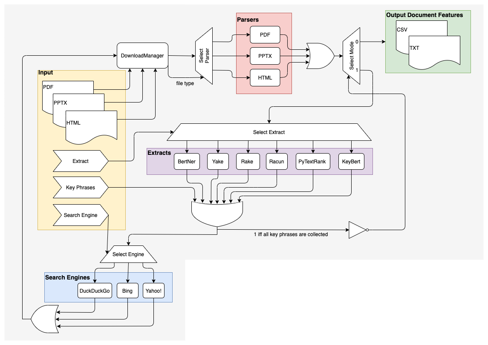

# Educational Resource Discovery Pipeline

## Overview

The Educational Resource Discovery (ERD) Pipeline scrapes the web given a list of queries and seed documents and parses any websites/documents that it finds. The scraping process downloads the top N results for a given query and then the parsers extract meta-features from the document's layout, URL and free text structure. The results are outputted to CSV files for manual annotations and downstream model training.

## Implementation


This section briefly traces through the circuit-like diagram that describe's the ERD Pipeline's control flow.

The pipeline accepts several forms of input. One can supply a set of seeding documents and/or an explicit list of key phrases. The seeding document URIs are forwarded to the DownloadManager that downloads them if they do not already exist in the local filesystem. Then, based on the file type (supported types are PDF, PPTX and HTML), a parser is created to wrap each seed document. These parsers are forwarded through the ’1’ channel of the ‘Select Mode’ demux to a set of 6 deep/statistical key phrase extraction methods (one of which is also specified by user input). Then these selected key phrases from the seeding documents are joined with the user-provided key phrase list.

Moving forward, the signal labelled with ‘*’ carries a 1 because all key phrases of interest are collected. These key phrases are forwarded to a search engine web scraper (selected by the user) which then begins to search for the key phrases and collect the top N URLs for each. These URLs are sent to the DownloadManager, then a parser is built for each consequently downloaded resource. Since signal ‘*’ is now 1, these parsers dump features of their designated document into a csv and the free text into a txt.

## Setup
The ERD Pipeline is implemented in `Python3` (specifically, versions 3.6 and 3.7). There are three main steps to installing this tool:
1. Install the required `Python3` libraries from the `requirements.txt` file. This can be achieved with:
```
pip install -r pipeline/requirements.txt
```
2. One of the libraries used for parsing, `Grobid`, requires a special installation since it runs as a localhost server and interfaces with the Python code via a REST interface. To download and build `Grobid`, follow the steps found [here](https://grobid.readthedocs.io/en/latest/Install-Grobid/). Note that the `Grobid` unit tests seem to be failing at the moment, so no need to worry about them.
3. Now navigate to the directory where you downloaded `Grobid` and start the server with
```
./gradlew run
```
You are now ready to start using the ERD Pipeline.

## Usage
The following is a sample command that can be run from the top-level directory of the project. This command has already been run and the results can be viewed within the `./pipeline/output` directory.
```
python -m pipeline.main \
    -kf ./pipeline/sample_queries.txt \
    -se Yahoo \
	-of ./pipeline/output/progress.log \
	-csv ./pipeline/output/data/csv \
	-txt ./pipeline/output/data/txt \
	-lf ./pipeline/output/annotation.csv \
	-sq 0 \
	-eq 10
```
- `-kf`: path to the key phrase file, which consists of a list of explicit queries for the pipeline to search for. A sample `sample_queries.txt` format for this file is:
```
DOMAIN nlp
"word embeddings" site:.edu filetype:.pdf, 25
"BERT models" site:.edu filetype:.pptx, 10
DOMAIN cv
"convolutional neural networds" site:.towardsdatascience.com filetype:.html, 50
```
The first two queries belong to a 'nlp' domain and the last belongs to the 'cv' domain - this allows you to organize your queries into their domains while preventing the output feature files from clashing (by name). For the first query, the ERD pipeline will aim to parse the top 25 search results, for the second query, the top 10 results will be parsed, etc.

- `-se`: the search engine to use. Current options are `Yahoo`, `Bing` and `DuckDuckGo`.
- `-of`: the output log file that keeps track of the pipeline's progress at runtime. This is useful for debugging purposes.
- `-csv`: the directory where the individual CSVs (containing the meta-feature set for each resource) should be saved
- `-txt`: the directory where the individual TXTs (containing the free text for each resource) should be saved
- `-lf`: the path to the CSV file which will contain the list of queries and their corresponding collected URLs. This file is is for the manual labeling of the resources.
- `-sq` and `-eq`: the 0-indexed start query and end query in the key phrase file respectively. In this example, it means that the first 10 (from [0,10)) key phrases from `sample_queries.txt` for each domain will be scraped.

Wait for a minute or so to finish the code. A correct run will output nothings. 

There are more command line options that were not covered in the above example, concerning the different key phrase extraction methods (from the seed documents), the current operating system (MacOS and Linux are currently supported) and so on. Full details, as well as the defaults and choices for all of the command line arguments can be discovered by running:
```
python -m pipeline.main -h
```

## Output files
```
cd ./pipeline/output/data/txt
```
A list of txt files will be generated, and they are the extracted free texts.
```
cd ./pipeline/output/data/csv
```
A list of csv files will be generated, and they are the meta-features we applied in the experiments (Group 1+2).

## Issues
If you have questions, feel free to submit issues. Thanks.
